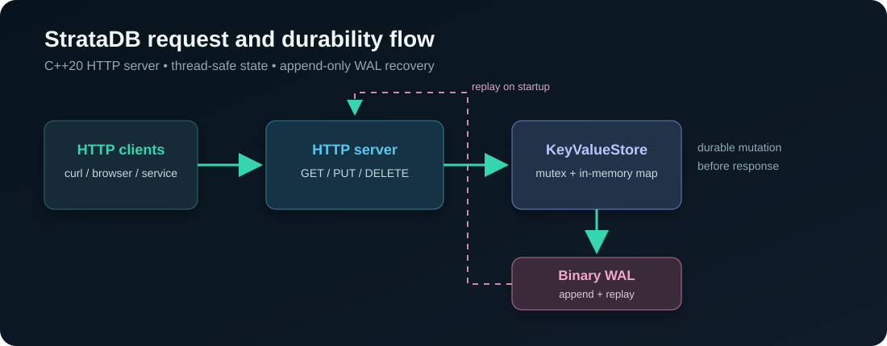
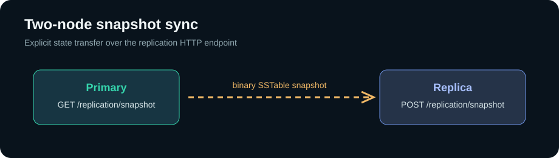

# StrataDB


> A compact C++20 storage engine with an HTTP API and durable write-ahead log.



StrataDB is a C++20 key-value storage engine built to explore the systems
problems behind durable backend infrastructure.

## Current Slice

The first vertical slice includes:

• thread-safe in-memory key-value storage;
• append-only binary WAL;
• replay and recovery after process restart;
• background compaction when the WAL reaches its configured threshold;
• optional key expiration with TTL persisted through WAL and SSTable files;
• HTTP API for `GET`, `PUT` and `DELETE`;
• health endpoint and Prometheus-style metrics;
• a minimal browser status page;
• CMake build, unit tests and Docker Compose.

## What Is Already Working

| Capability | Evidence |
| --- | --- |
| Durable writes | Every `PUT` and `DELETE` is appended to the binary WAL before the in-memory state changes |
| Crash recovery | The WAL is replayed during startup and restores the latest state |
| Compaction | `POST /compact` writes a sorted SSTable and safely resets the WAL |
| Background maintenance | A dedicated worker compacts the WAL asynchronously after the size threshold is reached |
| TTL | `PUT /kv/key?ttl=60` expires the key after 60 seconds and survives restart |
| Snapshot sync | A replica can import a binary snapshot from another StrataDB node |
| Incremental sync | Mutations are recorded in a sequence-numbered replication journal |
| Concurrent access | Store operations are protected by a mutex and HTTP requests are handled in separate threads |
| HTTP interface | `GET`, `PUT`, `DELETE`, health, metrics and a browser status page |
| Reproducible delivery | Docker image, Compose setup, CMake tests and GitHub Actions CI |

## API At A Glance

```text
PUT /kv/user-1  ──►  WAL append  ──►  memory update  ──►  201 Created
GET /kv/user-1  ──►  memory lookup  ──►  200 OK + value
DELETE /kv/user-1 ─►  WAL append  ──►  memory erase  ──►  204 No Content
GET /metrics    ──►  request counter + key count
POST /compact   ──►  sorted SSTable snapshot + WAL reset
PUT /kv/key?ttl=60 ──►  durable value with expiration timestamp
GET /replication/snapshot ──►  binary SSTable snapshot
POST /replication/snapshot ──►  replace local state from snapshot
GET /replication/changes?after=N ──►  changes with sequence > N
POST /replication/changes ──►  apply a change batch idempotently
```

## Run

```bash
docker compose up --build
```


Store a value:

```bash
curl -X PUT http://localhost:8080/kv/user-1 \
  -H 'Content-Type: text/plain' \
  --data 'Igor'
```

Read it back:

```bash
curl http://localhost:8080/kv/user-1
```

Metrics:

```bash
curl http://localhost:8080/metrics
```

Compact the current state into an SSTable:

```bash
curl -X POST http://localhost:8080/compact
```

Store a value with a one-minute TTL:

```bash
curl -X PUT 'http://localhost:8080/kv/session?ttl=60' \
  --data 'temporary value'
```

## Two-Node Snapshot Sync

The repository includes a two-node Compose demo. It is deliberately snapshot
replication, not a pretend consensus algorithm: the primary serves a complete
binary snapshot and the replica atomically installs it.



```bash
docker compose -f docker-compose.cluster.yml up --build -d
curl -X PUT http://localhost:18080/kv/order-1 --data 'ready'
curl http://localhost:18080/replication/snapshot > /tmp/stratadb.snapshot
curl -X POST http://localhost:18081/replication/snapshot \
  --data-binary @/tmp/stratadb.snapshot
curl http://localhost:18081/kv/order-1
```

The next replication milestone is incremental WAL shipping with sequence
numbers, followed by leader election and quorum acknowledgements. The current
incremental journal can be synchronized with:

```bash
scripts/replica-sync.sh http://localhost:18080 http://localhost:18081
```

Applying the same change batch twice produces the same final state. This is a
replication primitive, not yet a consensus protocol.

The WAL is mounted at `data/stratadb.wal`. Restarting the container restores
the key-value state from the log.

## Recovery Proof

The following scenario is covered by the local smoke test:

```text
$ curl -X PUT http://localhost:8080/kv/demo --data 'persistent value'
{"status":"stored"}

$ docker compose restart stratadb

$ curl http://localhost:8080/kv/demo
persistent value
```

The value is read from the replayed WAL after the process restart, not from a
preloaded fixture.

## Verification

The GitHub Actions pipeline runs a clean CMake build, the unit test suite and
a Docker image build on every push and pull request.

The storage format is intentionally small and inspectable: each mutation is
written as an operation byte followed by key and value lengths and their raw
bytes. The store replays the SSTable first and then the append-only WAL before
accepting requests. A background worker keeps the WAL from growing forever.

## Benchmark

The repository includes a small reproducible benchmark without external
dependencies:

```bash
cmake --build build --target stratadb_benchmark
./build/stratadb_benchmark
```

The benchmark writes and reads 10,000 values and prints elapsed time and
operations per second. It is intended for comparing storage changes, not as a
production performance claim.

## Local Build

```bash
cmake -S . -B build -DCMAKE_BUILD_TYPE=Debug
cmake --build build
ctest --test-dir build --output-on-failure
```

## Roadmap

The current storage layer has a WAL, an in-memory table and sorted SSTable
compaction. The next milestones are background compaction, snapshots, TTL,
benchmarks, Prometheus histograms and a three-node replication layer. Each
milestone will be backed by tests and a reproducible demo.
